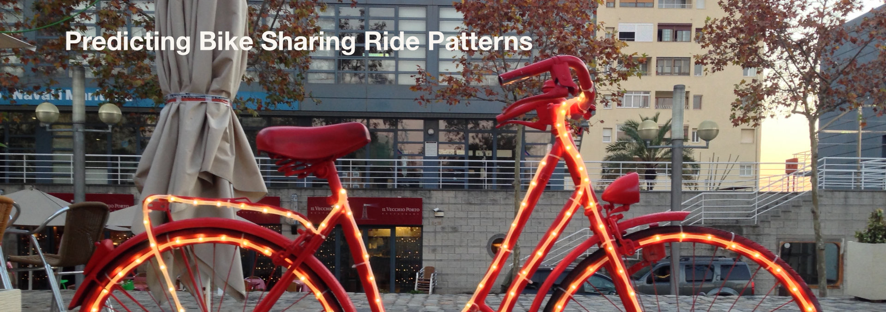
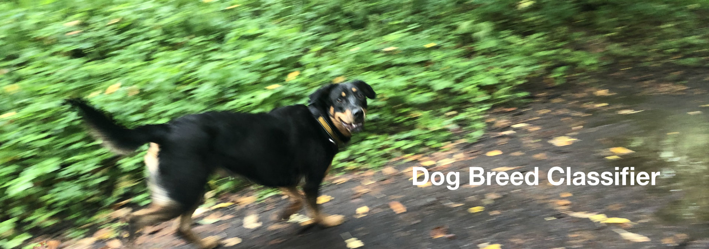
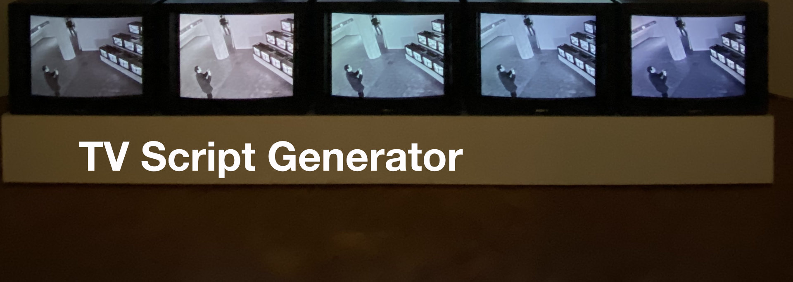
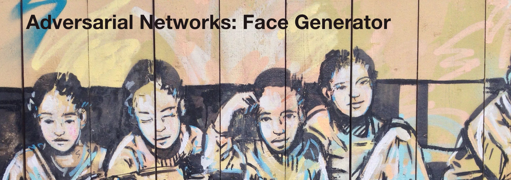

# Udacity Deep Learning Nanodegree Program 

This repository contains the projects I completed within the deep learning nanodegree program. The program uses PyTorch for model implementation. 

## Copyright (c) Udacity 
Most of the content in the notebooks and code is provided from and maintained by Udacity. 
I have included the copyright notice in this repository. See "License" for further information.

## Project 1 - Predict Bike Sharing Ride Patterns
Implemented a neural network with NumPy to predict bike rides for a bike sharing platform. The Bike Sharing Dataset comes from the UCI Machine Learning Database. 

## Project 2 - Dog Breed Classifier
Implemented an algorithm that uses several models to perform a sequence of tasks including:
* detection of human faces in an image using OpenCV's implementation of Haar feature-based cascade classifier
* detection of dogs in an image using a pretrained convolutional model (VGG16))
* comparison of performance to other pretrained convolutional model (ResNet50)
* creation of a CNN from scratch that classifies dog breeds
* creation of a CNN to classify dog breeds with transfer learning
* combination of the above models to create an algorithm that takes in an image. If a dog is detected in the image the algorithm indicates the dog breed. If a human is detected in the image the algorithm indicates the dog breed that resembles the human face. If neither a dog nor a human is detected it outputs an error. 

## Project 3 - TV Script Generator
* created a recurrent neural network to generate TV scripts for television shows 

## Project 4 - Face Generator
* Adversarial neural networks: created a generator and a discriminator to generate faces

## Project 5- Model Deployment Sagemaker
* Deployed a sentiment analysis model with AWS sagemaker. Services of the AWS platform were used to create a web app that predicts the sentiment (positive, negative) of a movie review provided by the user on a web page. 

