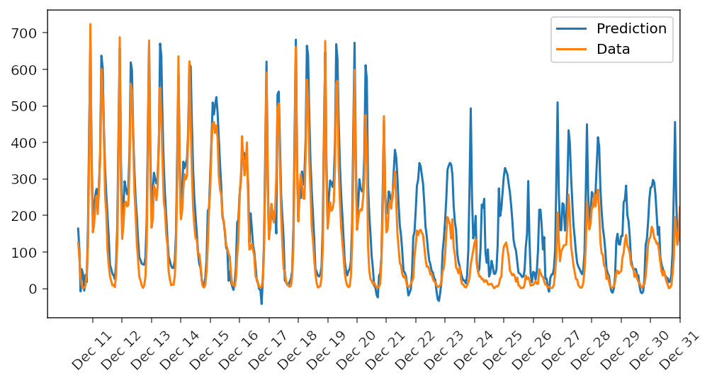

# Project 1: Predicting Bike Ride Patterns 

## Description 
A simple fully connected neural network with one hidden layer was constructed with Python and NumPy. 

The figure below displays the prediction of the model (blue line) and the data (orange line)

## Dataset
The bike sharing dataset used in this project is from the UCI Machine Learning Database:
[Dataset](https://archive.ics.uci.edu/ml/datasets/Bike+Sharing+Dataset)

